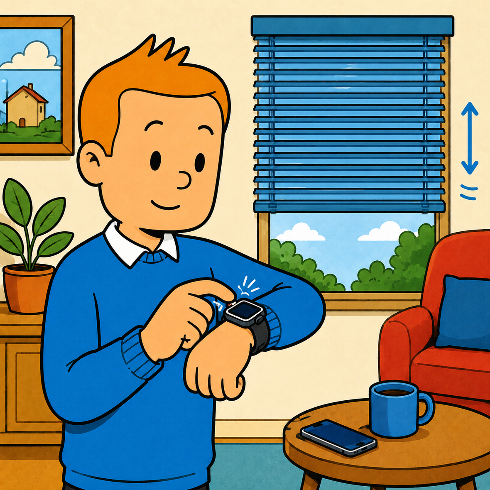
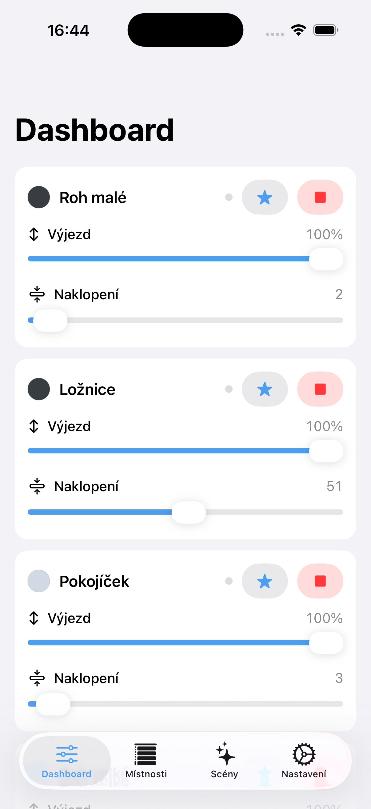
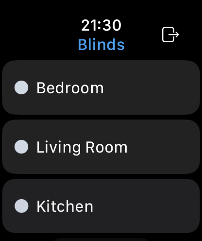
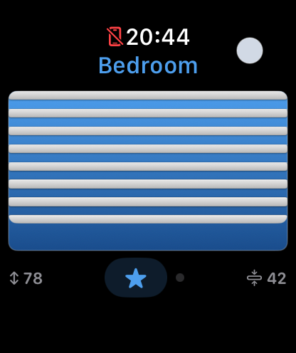

<div align="center">

# Slatly

**Apple Watch controller for Somfy exterior venetian blinds**

[slatly.punkhive.com](https://slatly.punkhive.com)



</div>

---

Slatly drives Somfy `ExteriorVenetianBlind` devices over the Overkiz cloud API straight from the wrist. No iPhone in your pocket, no hub on the wall, no extra bridge needed at runtime. The Digital Crown rotates slat tilt, a vertical drag sets closure, both axes commit together through a debounced `setClosureAndOrientation` call, and the on-screen blind graphic mirrors the actual device state with adjustable per-blind slat colour.

## Features

- **Watch-first**: rooms list, "All blinds" bulk view, individual tilt/closure detail, gold "My all" + red "Stop all" tiles for one-tap global actions
- **Dashboard on iPhone**: every blind on a single screen with inline closure + tilt sliders, per-row My / Stop buttons, no detail-screen drilling needed
- **Scenes**: "Morning", "Shade", "Night" presets, edit on iPhone, run with a single tap from the watch
- **iCloud sync**: credentials via iCloud Keychain, scenes via Keychain + WatchConnectivity, no extra entitlements required on real devices
- **Rename blinds**: per-device label override (swipe / context menu / detail toolbar)
- **Configurable My**: save the current closure + tilt as the "My" target per blind, or fall back to the Somfy device default
- **5 languages**: English, Czech, German, French, Spanish, with localized `CFBundleDisplayName`
- **watchOS launch complication** + **iOS home-screen widget** with deep-link buttons into Blinds / Scenes tabs

## Screenshots

| iPhone Dashboard | Watch rooms + scenes | Watch tilt detail |
| :--: | :--: | :--: |
|  |  |  |

## Architecture

A Swift 6 / xcodegen project with five pieces:

- **`App/`** watchOS SwiftUI app: rooms list with quick-action tile grid (scenes + My all + Stop all), individual `TiltView`, `BulkTiltView`
- **`iOS/`** full iPhone companion: Dashboard (default tab), Rooms (list + detail), Scenes (CRUD), Settings (sign in/out + tutorial)
- **`Shared/`** code used by both platforms: `BlindsGraphic`, `BlindTheme`, `ColorPaletteView`, `BlindScene` model, `SceneStore` (iCloud Keychain backed), `SceneSync` (WatchConnectivity push), `SceneRunner`, `BlindNameStore`, `MyPositionStore`
- **`WidgetExtension/`** watchOS launch complication (circular / corner / rectangular / inline)
- **`iOSWidgets/`** iOS home-screen widget with deep-link tiles into Blinds / Scenes tabs
- **`Packages/OverkizKit/`** SwiftPM library wrapping the Somfy Europe OAuth2 flow + `exec/apply` semantics, with a URLProtocol-mocked Swift Testing suite

> **Note on internal naming**: the Xcode project, target names (`Zaluzky`, `ZaluzkyWatch`, `ZaluzkyWidgets`, `ZaluzkyiOSWidgets`) and Bundle Identifiers (`com.punkhive.zaluzky*`) keep the original "Žaluzky" identifiers from when the app was first named that. They are intentionally left untouched: renaming them would invalidate iCloud Keychain entitlements (existing installs would lose their stored Somfy credentials) and force every TestFlight tester to re-pair. Only the user-facing brand is **Slatly**.

## Localization

UI strings live in per-target `Localizable.xcstrings` catalogues. The app ships in **English, Czech, German, French and Spanish**. The brand name "Slatly" is fixed across every locale (`CFBundleDisplayName` in `InfoPlist.xcstrings`). Per-locale UI labels (tab titles, navigation headers, button text) are translated normally, for example the Rooms tab is "Místnosti" in Czech, "Räume" in German, "Habitaciones" in Spanish, "Pièces" in French.

## Build

```sh
xcodegen generate
open Zaluzky.xcodeproj
```

You need Xcode 26 and `xcodegen`. Set the signing team on each target. Watch builds deploy directly to a paired Apple Watch via `xcrun devicectl device install app --device <udid> ZaluzkyWatch.app`.

One caveat worth knowing up front: Apple's 2025–2026 tooling refuses watchOS-only IPAs at upload (`Unknown platform alias received: watchOS`), so even though the watch app runs fully standalone, App Store / TestFlight distribution still requires the tiny iOS host target as a wrapper. See [this Apple Developer Forum thread](https://developer.apple.com/forums/thread/738218) for the gory details.

## Pre-release TODO

Two capabilities live in `Entitlements/*.entitlements` but are commented out of `project.yml` because they require enabling in the Apple Developer portal first:

- **iCloud Key-Value Store** (`com.apple.developer.ubiquity-kvstore-identifier`) for an additional cross-device scene-sync fallback alongside the current iCloud Keychain + WatchConnectivity paths
- **App Groups** which would enable a richer iOS widget that runs scenes inline via App Intents

After enabling those in App Store Connect, uncomment the `CODE_SIGN_ENTITLEMENTS` lines in `project.yml` and rerun `xcodegen generate`.

