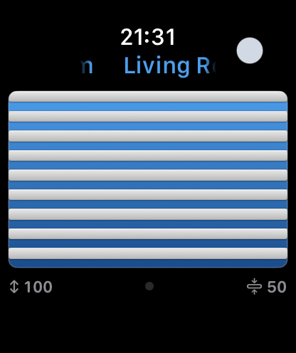

# Žaluzky

**Apple Watch controller for Somfy exterior venetian blinds**

 &nbsp; 

---

Žaluzky drives Somfy ExteriorVenetianBlind devices over the Overkiz cloud API straight from the wrist — no iPhone, hub, or extra bridge needed at runtime. The Digital Crown rotates the slat tilt and a vertical drag on the screen sets closure; both axes commit together through a debounced `setClosureAndOrientation` call, and the on-screen blind graphic mirrors the actual state with adjustable per-device slat colour.

The codebase is a Swift 6, xcodegen-driven project with three pieces: a watchOS SwiftUI app (`App/`), an `OverkizKit` SwiftPM library (`Packages/OverkizKit/`) that wraps the Somfy Europe OAuth2 flow plus `exec/apply` semantics and ships its own URLProtocol-mocked Swift Testing suite, and a minimal iOS companion (`iOS/`) whose only job is to provide a real keyboard for first sign-in — credentials then sync to the watch through `kSecAttrSynchronizable` iCloud Keychain.

To build it yourself you need Xcode 26 and `xcodegen`; run `xcodegen generate`, open `Zaluzky.xcodeproj`, set the signing team on both targets and you can deploy to a paired Apple Watch via `xcrun devicectl device install app`. One caveat worth knowing up front: Apple's 2025–2026 tooling refuses watchOS-only IPAs at upload (`Unknown platform alias received: watchOS`), so even though the watch app runs fully standalone, App Store / TestFlight distribution still requires the tiny iOS host target as a wrapper — see [this Apple Developer Forum thread](https://developer.apple.com/forums/thread/738218) for the gory details.
